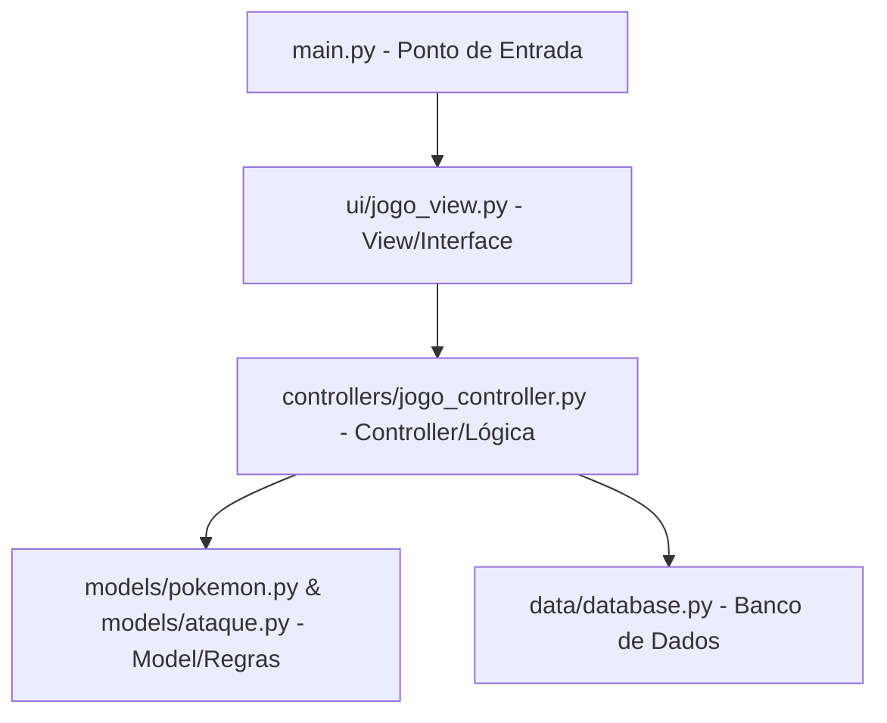

# 🎮 Batalha Pokémon — Jogo por Turnos com Interface Gráfica

Este projeto é um jogo de batalha Pokémon por turnos, desenvolvido em Python utilizando a biblioteca **Tkinter** para a interface gráfica e **SQLite** para persistência do histórico de batalhas. O design do código segue o padrão de arquitetura **MVC (Model-View-Controller)** para manter o projeto organizado, modular e de fácil manutenção.

---

## 🛠️ Tecnologias Utilizadas

*   **Linguagem:** Python 3.10+
*   **Interface Gráfica:** Tkinter (incluso no Python)
*   **Processamento de Imagens:** Pillow (PIL)
*   **Banco de Dados:** SQLite (nativo do Python)

---

## 📐 Arquitetura do Projeto (MVC)

O código foi modularizado seguindo as boas práticas do padrão MVC:



*   **Model (`models/`)**: Contém as classes que definem as entidades do jogo (`Pokemon` e `Ataque`) e suas regras específicas (cálculo de dano, uso de mana/PP, vantagens de tipo).
*   **View (`ui/`)**: Responsável por toda a parte visual, telas de login, seleção de pokémon, arena de batalha, histórico e efeitos visuais animados.
*   **Controller (`controllers/jogo_controller.py`)**: Coordena o fluxo do jogo, gerencia as rodadas, IA do oponente e faz a ponte entre a interface e os dados.
*   **Data (`data/`)**: Gerencia o banco de dados local SQLite (`batalhas_pokemon.db`) onde os registros das partidas são guardados.

---

## ✨ Funcionalidades e Características

1.  **Escolha do Pokémon:** O jogador escolhe entre 5 Pokémon iniciais:
    *   🔥 **Charmander** (Tipo Fogo)
    *   💧 **Squirtle** (Tipo Água)
    *   🍃 **Bulbasaur** (Tipo Planta)
    *   ⚡ **Pikachu** (Tipo Elétrico)
    *   🟤 **Eevee** (Tipo Normal)
2.  **Sistema de Batalha Avançado:**
    *   **Vantagens de Tipo:** Ataques super eficazes causam **2x** de dano (ex: Água contra Fogo), e ataques pouco eficazes causam **0.5x** de dano.
    *   **Precisão e Mana:** Ataques poderosos têm menor chance de acerto (Precisão) e limite de usos (Mana). Ataques básicos têm 100% de acerto e mais usos.
    *   **Inteligência Artificial:** O oponente escolhe dinamicamente os ataques disponíveis que possuem mana restante.
3.  **Efeitos Visuais e Animações (Tkinter):**
    *   **Barras de HP Suaves:** Diminuem gradualmente (com efeito *ease-out*) e mudam de cor conforme a vida restante (Verde ➡️ Amarelo ➡️ Vermelho).
    *   **Feedback de Dano:** Tela pisca em vermelho e os painéis dos Pokémon balançam quando sofrem dano.
    *   **Máquina de Escrever:** O log de batalha escreve os textos letra por letra.
4.  **Histórico Persistente:** Gravação automática de todas as partidas no banco de dados SQLite para consulta a qualquer momento.

---

## 📁 Estrutura de Diretórios

```text
Pokemon-Game-Comentado/
├── assets/                  # Imagens do jogo (PNGs dos Pokémon e Arena)
│   ├── fundo_jogo.png
│   ├── pokemon_agua.png
│   └── ...
├── controllers/             # Camada Controladora
│   └── jogo_controller.py   # Controlador de fluxo e turnos do jogo
├── data/                    # Camada de Persistência
│   ├── database.py          # Gerencia conexão e querys SQL
│   └── batalhas_pokemon.db  # Banco SQLite (gerado automaticamente)
├── models/                  # Regras de Negócio e Lógica
│   ├── ataque.py            # Estrutura de dados de cada ataque
│   └── pokemon.py           # Subclasses de Pokémon e vantagens de tipo
├── ui/                      # Camada de Interface
│   └── jogo_view.py         # Janelas, botões, telas e animações (Tkinter)
├── main.py                  # Ponto de entrada do sistema
└── README.md                # Este documento explicativo
```

---

## 🚀 Como Executar o Projeto

Escolha uma das duas formas abaixo para iniciar o jogo:

### ⚡ Modo Rápido: Usando o Executável Compilado (Recomendado)
**Não precisa de Python nem de nenhuma dependência instalada.**
1. Vá até a pasta raiz do projeto.
2. Dê dois cliques no arquivo:
   *   `BatalhaPokemon.exe`

*Nota: Esse executável é 100% independente (contém todas as imagens e códigos embutidos). Quando executado pela primeira vez, ele criará automaticamente o banco de dados `batalhas_pokemon.db` na mesma pasta do executável para persistir o seu histórico.*

---

### 💻 Modo Desenvolvedor: Executando via Código-Fonte (Python)
Use esta opção caso queira modificar o código-fonte do jogo.

#### 1. Acessar a Pasta do Projeto
Abra o seu terminal na pasta do jogo:
```bash
cd Pokemon-Game-Comentado
```

#### 2. Instalar as Dependências
Instale os pacotes necessários de uma só vez (necessário apenas na primeira execução):
*   **No Windows:** Dê dois cliques no arquivo `setup.bat`.
*   **Via Terminal (Qualquer SO):**
    ```bash
    pip install -r requirements.txt
    ```

#### 3. Executar o Jogo
Rode o script principal:
```bash
python main.py
```

---

## 🎮 Como Jogar

1.  **Faça Login:** Digite o nome do seu treinador na tela inicial. Se quiser ver os registros anteriores, clique em **"Ver Histórico"**.
2.  **Escolha seu Pokémon:** Clique em um dos 5 cards com as imagens dos monstrinhos. Cada um possui vantagens exclusivas.
3.  **Batalhe por Turnos:** Você enfrentará todos os outros 4 Pokémon do torneio em sequência. Use seus ataques com sabedoria!
    *   Ataques com alto dano (como *Hidrobomba* ou *Trovão*) têm pouca precisão e pouca mana. Use-os com cautela.
    *   Ataques básicos sempre acertam e ajudam a finalizar o oponente.
4.  **Consulte o Histórico:** Após ganhar ou perder, sua pontuação será salva e estará visível na tela inicial no histórico de batalhas.
